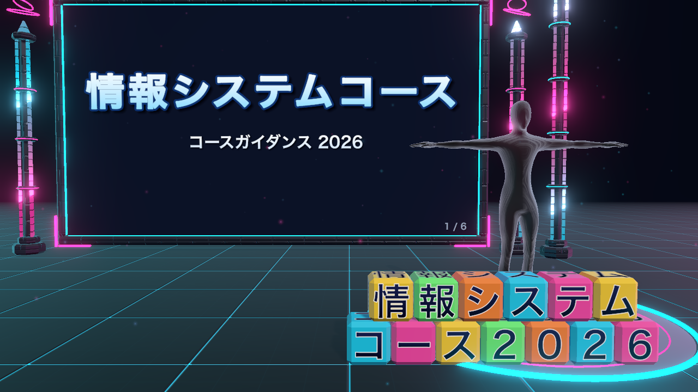
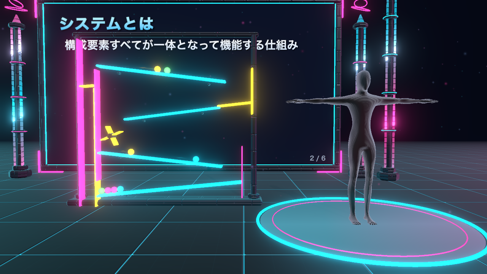

# MocopiPresenter

mocopi（Sony のモバイルモーションキャプチャー）で動く 3D アバターが、舞台の上でプレゼンするための Unity アプリです。
名古屋文理大学 情報メディア学科「情報システムコース」のコースガイダンス（2026年度）のために作りました。

アバターの動きは物理演算の仕掛けとつながっていて、場面ごとに体を使って操作できます。

| 場面 1：文字の積み木 | 場面 2：マーブルマシン |
|---|---|
|  |  |

※ 画像のアバターは、プラグイン同梱のサンプルアバターです。

## 場面

| # | 場面 | 仕掛け |
|---|---|---|
| 1 | 表紙 | ジャンプすると文字の積み木が降ってくる。蹴ると飛び、手で叩くと爆発する |
| 2 | システムとは | 物理演算で動くマーブルマシン。部品が1つ欠けていて玉がこぼれる。手で部品を運んではめると、玉が回り続ける |
| 3 | いま動いているのもシステム | 回転式スタンド。手で触れるたびに、センサー → レシーバー → PC → アバター → プロジェクターの順に1面ずつ回る |
| 4 | 何を学ぶか | 言語や技術の名前の積み木が空から降り、舞台を埋める |
| 5 | コーディングエージェントと開発 | 居眠りするロボットを鞭で起こして働かせ、押し寄せるバグを撃破させる |
| 6 | 続きはゲームで | 学生用ゲームの QR コードと検索手順を出す |

場面の文言と仕掛けの設定は `Assets/StreamingAssets/Presentations/guidance2026/slides.json` に書いてあります。
ビルド後も、アプリのフォルダ内の `MocopiPresenter_Data/StreamingAssets/Presentations/guidance2026/slides.json` を書き換えれば、作り直さずに内容を変えられます。

## プレゼンを差し替える

1つのアプリで複数のプレゼンを扱えます。プレゼンは `StreamingAssets/Presentations/〈名前〉/` に1つずつ置きます。

1. `guidance2026` フォルダをまねて、新しいフォルダに `slides.json` を作る。画像などの素材も同じフォルダに置く。
2. 使うプレゼンの名前を `StreamingAssets/Presentations/selected.txt` に書く（起動時の引数 `-presentation 名前` でも選べる）。

各場面の `gimmicks` に仕掛けの名前を書くと、その場面で仕掛けが出ます。

| 仕掛け | 内容 | 場面に書く設定 |
|---|---|---|
| `blocks` | 文字の積み木 | `blocks`（積む文字の行）、`blocksOnJump`、`jumpHeight`、`rain`（降らせる言葉） |
| `marble` | マーブルマシン | なし |
| `stand` | 回転式スタンド | `stand`（`icon` と `label` の並び）、`note` |
| `agents` | コーディングエージェント | `agents`（数）、`troubles`（トラブルの名前）、`crackSpeed` |
| `qr` | QR コードの案内 | `qr`（`title`、`caption`、`heading`、`steps`、`image`） |

新しい仕掛けの作り方は [CLAUDE.md](CLAUDE.md) の「仕掛けを足す」を参照してください。

## 動かす

### 必要なもの

- Windows PC（プロジェクターをつなぐノート PC を想定）
- mocopi のセンサー6個と、センサーデータレシーバー（QM-PR1）
- mocopi PC アプリ（Microsoft Store）

スマホの mocopi アプリから送る場合も、同じ手順で受信できます。

### 手順

1. [Releases](../../releases) から `MocopiPresenter-Windows-*.zip` をダウンロードして展開する。
2. プロジェクターをつなぎ、Windows の画面設定を「表示画面を拡張する」にする。ノート PC の画面を「メインディスプレイ」にする。
3. `MocopiPresenter.exe` を起動する。初回はファイアウォールの確認が出るので許可する。
4. mocopi PC アプリの送信設定を、送信先 `127.0.0.1`、ポート `12351`、フォーマット mocopi (UDP) にして送信を始める。
5. 手元の画面の左上に「受信中」と出れば、アバターが動きます。

### 画面の使い分け

- **プロジェクター（2台目）**：観客向けの映像を全画面で出します。
- **ノート PC（1台目）**：発表者用。同じ映像と、操作一覧・今の場面・次の場面を出します。
  会場を向いて発表すると左右が逆に感じるので、**F キーで左右反転（鏡合わせ）** を切り替えられます（2台のときは ON で始まり、設定は次回に引き継ぎます）。
- モニターが1台なら、その画面に観客向けの映像を出します。

### キー操作

| キー | 動作 |
|---|---|
| → / Space / PageDown | 次の場面 |
| ← / PageUp | 前の場面 |
| Home | 最初の場面 |
| 1〜4 | カメラ（全体 / 全身 / 上半身 / スクリーン） |
| J / B | 積み木を降らせる・積み直す（場面1。ジャンプの代わり） |
| M | 部品をはめる・戻す（場面2） |
| T / Shift+T | スタンドを1面回す・逆回り（場面3） |
| W | エージェントを働かせる（場面5。鞭の代わり） |
| Q | ゲーム案内（QR）の表示 |
| S | 音のオン・オフ |
| F | 手元の画面の左右反転 |
| H | 操作一覧を隠す・出す |
| R | IP アドレスの再取得 |
| Esc | 終了 |

### 反応の調整

`slides.json` の各場面に次の値を書き足すと、体の動きへの反応しやすさを変えられます（同じ場面に `gimmicks` で仕掛けを指定しておく必要があります）。

| 値 | 場面 | 意味 | 既定 |
|---|---|---|---|
| `jumpHeight` | 1 | ジャンプとみなす腰の上がり幅（m）。下げると反応しやすい | 0.12 |
| `crackSpeed` | 5 | 鞭が鳴ったとみなす先端の速さ（m/秒）。下げると反応しやすい | 8 |

## 開発する

- Unity 6000.3.19f1（Unity 6.3 LTS）
- プロジェクトを開いて `Assets/Guidance/Scenes/Guidance.unity` を開きます。
- 舞台や仕掛けは、手で配置せずスクリプトで組み立てています（`Assets/Guidance/Editor/`）。
  メニュー **Guidance → シーンを作り直す** で、シーンを作り直せます。
- 形（面取りした箱や柱）、質感（凹凸・映り込み）、効果音は、画像や音源ファイルを使わずに計算で作っています。
- ビルドはメニュー **Guidance → Windows アプリをビルド** / **macOS アプリをビルド** から行えます。

### 動作の確認（ビルドしない）

物理の仕掛けは、エディタをバッチモードで再生して確かめられます。決めた時刻に操作と画面の書き出しを行い、`Build/test-*.png` に画像を出します。

```bash
Unity -batchmode -projectPath . -executeMethod Guidance.EditorTools.PlayTest.Marbles
```

ほかに `PlayTest.Blocks`、`PlayTest.Stand`、`PlayTest.Rain`、`PlayTest.Agents` があります。

### アバターを RAYNOS に差し替える

このリポジトリのアバターは、mocopi Receiver Plugin に同梱のサンプルアバターです。
mocopi 公式アバター「RAYNOSちゃん」は再配布が禁止されているため含めていません。使う場合は次の手順で差し替えます。

1. [mocopi 開発者サイトの配布ページ](https://www.sony.co.jp/en/Products/mocopi-dev/jp/downloads/DownloadCharacter.html) で利用許諾を確認し、`RAYNOS-chan-avatar_v1.0.8.zip` を入手する。
2. 中の `RAYNOS-chan_1.0.6.vrm` を `Assets/Guidance/Avatars/RAYNOS/` に置く（このフォルダは Git の管理対象外です）。
3. 次のコマンドでシーンを作り直す。VRM の取り込みと差し替えが自動で行われます。

```bash
Unity -batchmode -projectPath . -executeMethod Guidance.EditorTools.GuidanceSetup.ImportAvatarAndCreateScene
```

RAYNOS を入れてビルドしたアプリは、再配布しないでください。

## ライセンス

このリポジトリのオリジナル部分は [MIT ライセンス](LICENSE) です。
同梱している mocopi Receiver Plugin for Unity（Apache License 2.0）、UniVRM（MIT）などのライセンスは [THIRD_PARTY_NOTICES.md](THIRD_PARTY_NOTICES.md) を参照してください。

このアプリは個人が作ったもので、ソニーの公式アプリではありません。
